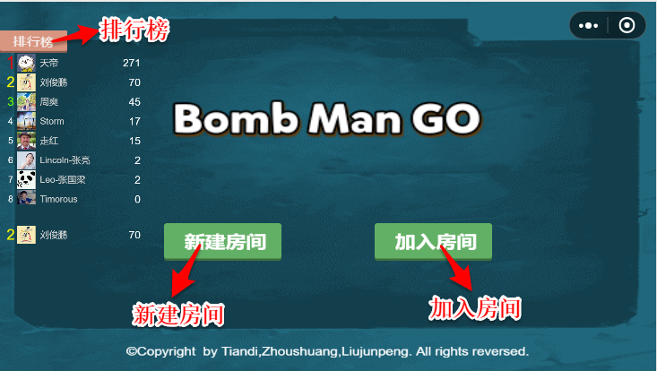
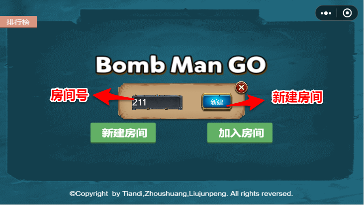
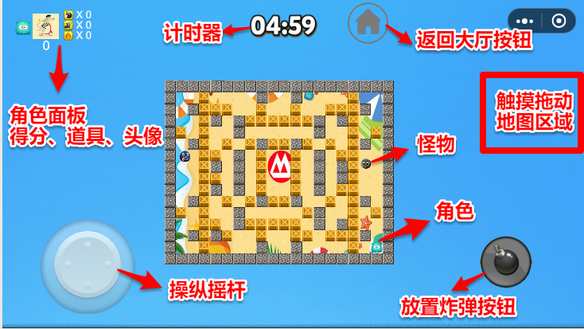
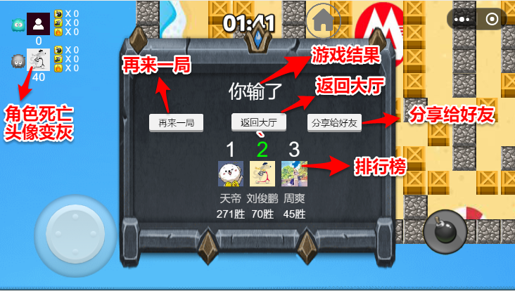

# 天帝泡泡堂 —— 设计文档

## 项目需求

1. 微信小游戏
2. 双人对战（开房间，分享点击进入，房间号进入）
3. 炸死立即结束，没死定时60s结束，计分判定胜利（得分：炸墙，吃道具）
4. 没有闯关
5. 道具有： 增加炸弹威力、增加炸弹个数、移动加速5s
6. 出生点为地图对角线
7. 实时显示双方分数和道具状态
8. 战绩炫耀、再来一局、好友战绩排行
9. 可选需求：增加野怪

## 游戏成果概览
### 简介
- 本游戏为一款支持一到四人对战的游戏，每局游戏时间为5分钟。
- 玩家通过放置炸弹，炸掉障碍物获得分数，或者炸死敌人淘汰敌人。
- 当一个玩家淘汰掉其他所有玩家时获得胜利，或者5分钟倒计时结束，得分最多的玩家获得胜利。
### 界面介绍
1. 主界面
   
   
   - 主界面中包含三个按钮，**排行榜**、**新建房间**、**加入房间**
   - **排行榜**  点击显示排行榜，再次点击收起
   - **新建房间** 点击显示**2.新建房间**面板,如果大厅里没有房间，你可以选择新建房间
   - **加入房间** 点击显示**3.房间列表**面板,如果你想加入其它玩家的房间一起游戏，可以点击加入房间
2. 新建房间
   
   
   在新建房间面板输入**房间号**，点击**新建**，就可以新建一个房间，此时会跳转到**游戏等待面板**。而其他玩家可以通过**房间列表面板**加入你的房间。
3. 房间列表
   
   
   - 房间列表面板里会显示带房间号的按钮，灰色的为**已经开始游戏**的房间，玩家不能加入；橘红色的为**未开始游戏**的房间，玩家可以点击加入，点击后会跳转到**4.游戏等待**面板
4. 游戏等待
   
   
   - 在游戏等待界面，会显示当前房间里所有玩家的微信头像，最多容纳四名玩家
   - 房间里所有的玩家都可以点击**分享**按钮分享给好友
   - 房间里所有的玩家都可以点击**开始**按钮开始游戏
   - 玩家也可以点击右上角**退出**按钮，退出当前房间
5. 游戏开始
   
   
   - **角色面板** 角色面板显示每个角色的头像、得分以及道具数
   - **计时器** 每局游戏时间为五分钟
   - **返回大厅按钮** 中途想退出游戏，可以点击返回大厅按钮，退出游戏，返回大厅
   - **触摸拖动区域** 按住这个区域不放，开始拖动可以移动角色的视角
   - **地图** 角色所有的动作都在地图里完成，地图为二维数组，可以通过改变二维数组的值来动态改变地图
   - **怪物** 游戏初始化的时候会初始化若干个怪物，怪物随机移动，一旦碰到角色，角色死亡，怪物可被炸弹炸死
   - **角色** 每个玩家对应一个角色，角色在游戏初始化的时候随机生成，每个角色放置的炸弹颜色不同
   - **操纵摇杆** 玩家可以通过操纵摇杆控制角色进行360°移动
   - **放置炸弹按钮** 玩家点击这个按钮可以放置一个炸弹，初始时最多可以放置两个炸弹，后续可以通过吃增加炸弹数的道具增加

6. 游戏进行
   
   
   - 角色会始终保持在屏幕中间
   - 炸掉一个箱子得分增加10分
   - 箱子爆炸后会随机出现道具（加速、增加炸弹数、增加威力）
   - 当倒计时时间结束，或者玩家炸死了其他所有玩家后，会弹出**7.游戏结束**面板
   - 当角色死亡时，相应的角色头像和微信头像会变灰
7. 游戏结束
   
   
   - 游戏结束面板上有**再来一局**、**返回大厅**、**分享给好友**三个功能按钮
   - 按钮组上方为游戏结果；输、赢或者是平局
   - 按钮组下方为**胜场排行榜**
8. 微信分享界面
   
   

   - 可以通过分享按钮分享给微信好友
   - 微信好友收到上图的分享链接,点击链接可以加入游戏，即直接跳转到**4.游戏等待**面板
## 架构概要设计

经过一周的调研及POC验证，我们最终采用 CocosCreator + NodeJS + SocketIO 作为技术栈来实现游戏需求。前端页面渲染及用户操作捕捉通过CocosCreator实现，而所有游戏运行逻辑及游戏房间管理由NodeJS后端完成。前后端各自独立并通过基于Websocket协议(WS)的SocketIO库进行实时数据通信，WS协议允许服务端主动地向客户端推送数据请求。

CocosCreator是Cocos游戏团队与微信团队合作推出的一款微信小游戏引擎，通过它可以快速的搭建游戏前端页面逻辑，并可快速打包发布到微信小游戏平台。通过CocosCreator，我们实现了基本的游戏界面显示及跳转逻辑，并通过设计摇杆等控件捕捉到了用户的实时操作并将其传输给后台Node服务器，Node服务器处理后再返回实时游戏信息给前台进行渲染。

NodeJS作为后端，实现了所有的游戏业务逻辑，如游戏角色的移动、泡泡的放置与爆炸、地图及道具信息管理等。后端接收到前台用户传来的上、下、左、右及泡泡按键信息后，实时地运算最新游戏数据，并返回给前台渲染。游戏过程如下图所示。

### 时序图

用户创建房间、加入房间时序图：

后台响应开始游戏请求时序图：

### 活动图

后台响应前端操作过程如下图所示：

游戏角色放置泡泡炸弹过程如下图所示：

### 微信API
除此之外，我们还接入了微信官方提供的API来获得用户信息，如昵称、头像、性别等信息。调用微信的开放数据域接口来存储用户的胜场信息并以此来计算排行榜。用户在游戏中可以看到自己在所有好友中的游戏排名。

1. 微信授权

    [https://developers.weixin.qq.com/minigame/dev/document/open-api/authorize/wx.authorize.html](https://developers.weixin.qq.com/minigame/dev/document/open-api/authorize/wx.authorize.html)  

    `wx.authorize(Object object)`

    提前向用户发起授权请求。调用后会立刻弹窗询问用户是否同意授权小程序使用某项功能或获取用户的某些数据。

2. 微信登陆

    [https://developers.weixin.qq.com/minigame/dev/document/open-api/login/wx.login.html](https://developers.weixin.qq.com/minigame/dev/document/open-api/login/wx.login.html)  

    `wx.login(Object object)`

    调用接口获取登录凭证（code）进而换取用户登录态信息

3. 通过微信开放域获得好友数据

    [https://developers.weixin.qq.com/minigame/dev/tutorial/open-ability/open-data.html](https://developers.weixin.qq.com/minigame/dev/tutorial/open-ability/open-data.html)

    `wx.getFriendCloudStorage()`

    获取当前用户也玩该小游戏的好友的用户数据

## 原型部署

Front-end using cocos-creator: [https://github.com/leviscar/bnb](https://github.com/leviscar/bnb)

Back-end using nodejs & socket.io: [https://github.com/yolanda712/bnbServer](https://github.com/yolanda712/bnbServer)

原型实现后，我们将前端游戏界面发布到了微信公众平台和Web端上，用户可以扫码进行试玩（暂时需要管理员设置体验者权限，微信号：xietiandi93），也可以直接登录 https://www.x-lab.ac 进行体验，网页版和微信端可以一起进行对战。

NodeJS后端被打包成了Docker镜像，部署在了远程腾讯云服务器上（1核，1M带宽，2G内存）。通过域名访问，我们的微信端和网页端均可成功连接到后台服务器。为了监控后台服务器的实时性能消耗，我们还搭建了一套开源Docker性能监控工具（cAdvisor + Prometheus + Grafana），可以通过 https://www.x-lab.ac/monitor 进行访问，首次进入较慢，用户名密码 admin/admin。整体部署图如下所示：

